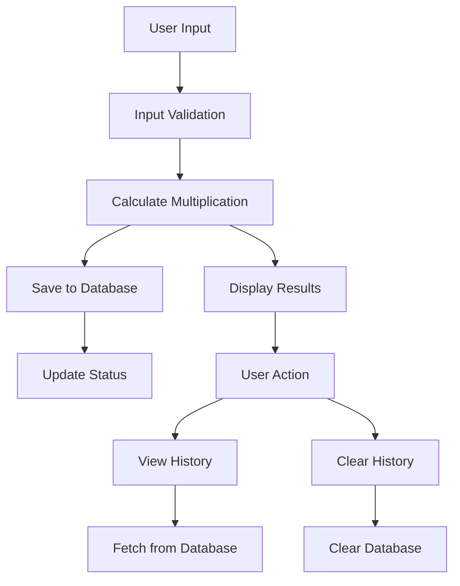

# 🧮 Daftar Perkalian

<div align="center">


**Program perkalian interaktif dengan GUI modern dan sistem penyimpanan history**

[Fitur](#-fitur) • [Instalasi](#-instalasi) • [Penggunaan](#-penggunaan) • [Dokumentasi](#-dokumentasi) 

</div>

## 📋 Daftar Isi

- [Gambaran Umum](#-gambaran-umum)
- [Fitur](#-fitur)
- [Instalasi](#-instalasi)
- [Penggunaan](#-penggunaan)
- [Dokumentasi](#-dokumentasi)
- [Troubleshooting](#-troubleshooting)
- [FAQ](#-faq)

## 🚀 Gambaran Umum

**Daftar Perkalian** adalah aplikasi Python modern yang mengubah program perkalian sederhana menjadi aplikasi GUI yang powerful dengan sistem penyimpanan history dan interface yang user-friendly. Aplikasi ini dirancang untuk membantu pembelajaran matematika dengan cara yang menyenangkan dan interaktif.

### ✨ Highlights

- 🎨 **GUI Modern** dengan Tkinter yang responsive
- 💾 **Database SQLite** untuk penyimpanan permanen
- 📊 **History System** dengan timestamp lengkap
- 🎯 **Input Validation** dan error handling yang robust
- 📈 **Statistik Tambahan** (total dan rata-rata)
- 🚀 **Ready to Use** - langsung jalan tanpa instalasi tambahan

## 🌟 Fitur

### 🧮 Core Features
- **Tabel Perkalian 1-10** - Menampilkan hasil perkalian dengan format yang rapi dan mudah dibaca
- **Perhitungan Real-time** - Hasil langsung tampil tanpa delay
- **Support Bilangan Positif & Negatif** - Fleksibel untuk berbagai jenis bilangan
- **Auto-save** - Otomatis menyimpan setiap perhitungan ke history

### 💾 Data Management
- **SQLite Database** - Penyimpanan data yang reliable dan efisien
- **History Permanen** - Data tersimpan meski aplikasi ditutup
- **Timestamp Recording** - Waktu setiap operasi terekam secara detail
- **Data Retrieval** - Mudah mengambil dan melihat history sebelumnya

### 🎨 GUI Features
- **Modern Interface** - Design yang clean, modern, dan profesional
- **Responsive Layout** - Adaptif terhadap berbagai ukuran layar
- **Real-time Feedback** - Status bar yang informatif
- **Keyboard Navigation** - Support Enter untuk submit
- **Color Coding** - Skema warna yang eye-friendly dan konsisten

### ⚡ User Experience
- **Input Validation** - Validasi input yang ketat
- **Error Handling** - Penanganan error yang elegan
- **Confirmation Dialogs** - Konfirmasi untuk operasi penting
- **Welcome Message** - Panduan penggunaan yang jelas

### Alur Penggunaan

1. **Input Bilangan** → Masukkan bilangan di kolom input
2. **Tampilkan Hasil** → Klik tombol atau tekan Enter
3. **Lihat History** → Akses riwayat perhitungan sebelumnya
4. **Kelola Data** → Bersihkan history jika diperlukan

## 📥 Instalasi

### Prerequisites

- **Python 3.7** atau lebih tinggi
- **Tkinter** (biasanya sudah termasuk dalam instalasi Python standar)

### Verifikasi Tkinter

Sebelum menjalankan, pastikan Tkinter terinstall dengan menjalankan:

```bash
python -m tkinter
```

Jika muncul window kecil, Tkinter siap digunakan.

### Step-by-Step Installation

1. **Download Project**
   ```bash
   # Jika menggunakan git
   git clone https://github.com/username/program-perkalian-super.git
   cd program-perkalian-super
   
   # Atau download langsung file ZIP dan ekstrak
   ```

2. **Jalankan Program**
   ```bash
   python main.py
   ```

### Quick Start (Windows)

1. Download semua file project
2. Simpan dalam folder yang sama
3. Double-click `main.py` atau jalankan via command prompt:
   ```cmd
   python main.py
   ```

## 🎮 Penggunaan

### Memulai Aplikasi

```bash
python main.py
```

Aplikasi akan langsung membuka window GUI dengan tampilan welcome message.

### Basic Usage

1. **Input Bilangan**
   - Masukkan bilangan bulat (positif atau negatif) di kolom input
   - Contoh: `5`, `-3`, `10`, `-7`

2. **Tampilkan Perkalian**
   - Klik tombol **"🧮 Tampilkan Perkalian"** atau tekan **Enter**
   - Hasil perkalian 1-10 akan ditampilkan di area hasil

3. **Melihat History**
   - Klik tombol **"📊 Lihat History"** untuk melihat riwayat perhitungan
   - History menampilkan data dengan timestamp lengkap

4. **Bersihkan History**
   - Klik tombol **"🗑️ Bersihkan History"** untuk menghapus semua data
   - Konfirmasi dialog akan muncul untuk mencegah penghapusan tidak sengaja

### Contoh Penggunaan

**Input:**
```
7
```

**Output:**
```
📊 TABEL PERKALIAN 7
========================================
  7 ×  1 =   7
  7 ×  2 =  14
  7 ×  3 =  21
  7 ×  4 =  28
  7 ×  5 =  35
  7 ×  6 =  42
  7 ×  7 =  49
  7 ×  8 =  56
  7 ×  9 =  63
  7 × 10 =  70

========================================
✨ Total: 385
📈 Rata-rata: 38.5
```

### Keyboard Shortcuts

| Shortcut | Action |
|----------|--------|
| `Enter` | Tampilkan perkalian |
| `Ctrl + C` | Keluar aplikasi |
| `Tab` | Navigasi antara elemen input |

## 📚 Dokumentasi

### Workflow Diagram


---

### File Descriptions

| File | Description |
|------|-------------|
| `main.py` | Entry point aplikasi, menjalankan GUI |
| `gui_app.py` | Implementasi GUI lengkap dengan Tkinter |
| `database.py` | Management SQLite database dan operasi CRUD |
| `styles.py` | Konfigurasi warna, font, dan styling GUI |
| `history_perkalian.db` | File database SQLite (auto-generated) |


## 🐛 Troubleshooting

### Common Issues

**Issue:** "TclError: Can't find a usable tk.tcl"
**Solution:** Install Tkinter development packages

**Windows:**
```cmd
pip install tk
```

**Ubuntu/Debian:**
```bash
sudo apt-get install python3-tk
```

**MacOS:**
```bash
brew install python-tk
```

**Issue:** Database permission error
**Solution:** Pastikan folder writable atau run as administrator

**Issue:** GUI tidak responsive
**Solution:** Pastikan tidak ada proses Python yang masih berjalan di background

### Error Messages

- **"Masukkan bilangan yang valid!"** → Input harus berupa bilangan bulat
- **"Silakan masukkan bilangan terlebih dahulu!"** → Kolom input kosong
- **"Gagal memuat history"** → Problem dengan database access


## ❓ FAQ

### Q: Apakah perlu install library tambahan?
**A:** Tidak! Program ini menggunakan Python standard library saja (Tkinter, sqlite3).

### Q: Di mana data history disimpan?
**A:** Data tersimpan di file `history_perkalian.db` dalam folder yang sama dengan aplikasi.

### Q: Bagaimana cara backup data?
**A:** Cukup backup file `history_perkalian.db` untuk menyimpan semua history.

### Q: Bisakah digunakan di sekolah untuk pembelajaran?
**A:** Sangat bisa! Aplikasi ini cocok untuk pembelajaran matematika dasar.

### Q: Apakah support bilangan desimal?
**A:** Saat ini hanya support bilangan bulat (integer).

### Q: Bagaimana cara reset aplikasi?
**A:** Hapus file `history_perkalian.db` dan restart aplikasi.

### Q: Bisakah dicompile menjadi executable?
**A:** Bisa menggunakan PyInstaller:
```bash
pip install pyinstaller
pyinstaller --onefile --windowed main.py
```

---

<div align="center">

**⭐ Jangan lupa beri bintang jika project ini membantu! ⭐**

[Kembali ke Atas](#-daftar-perkalian)

</div>